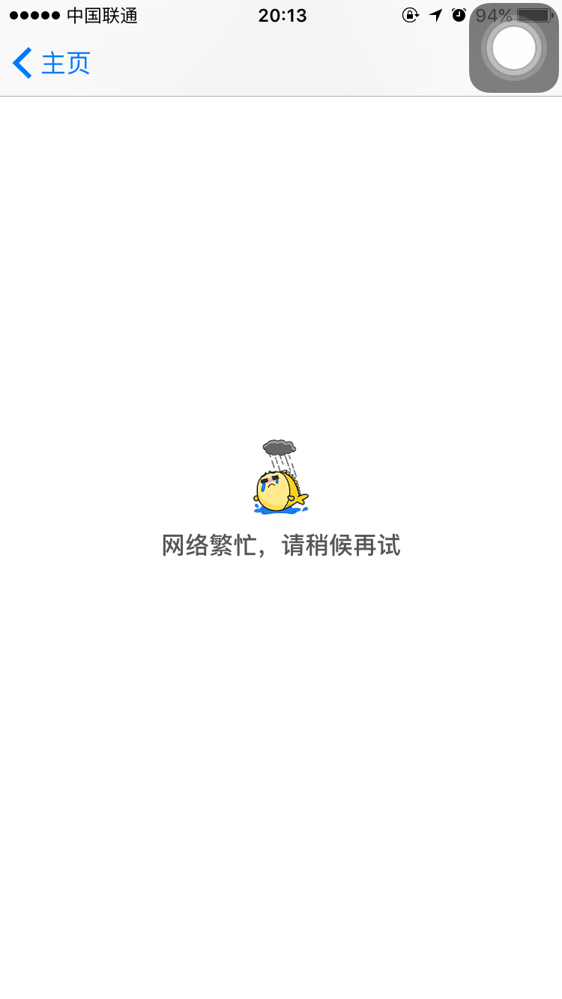
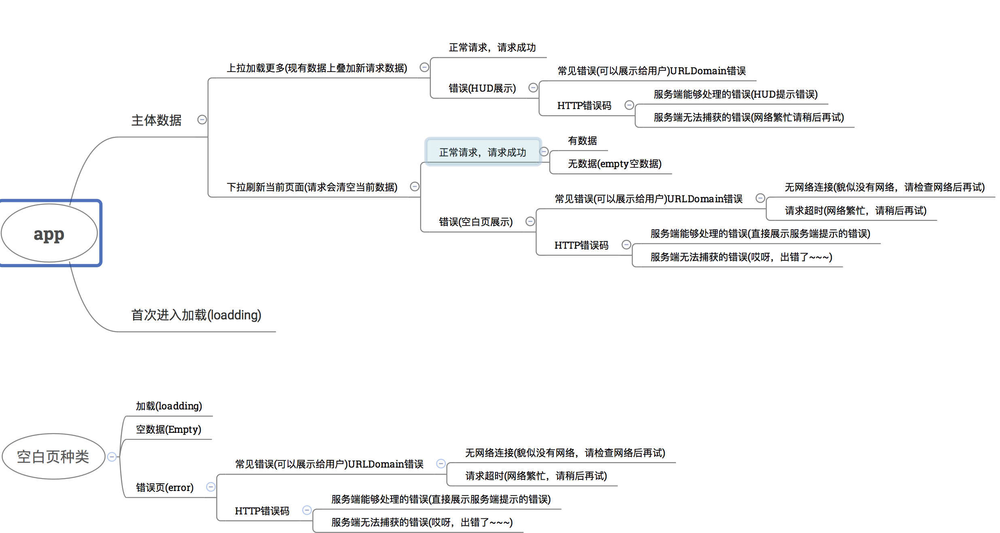
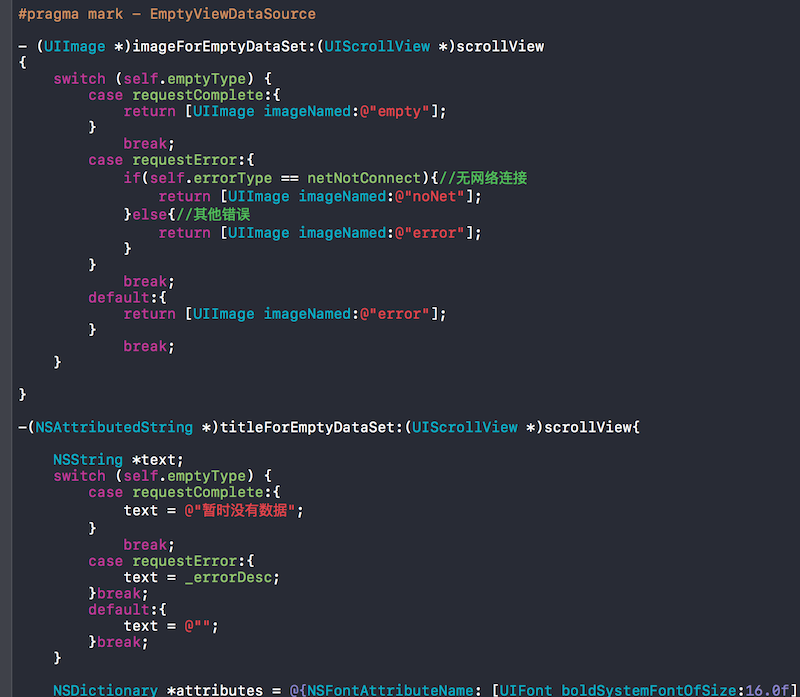
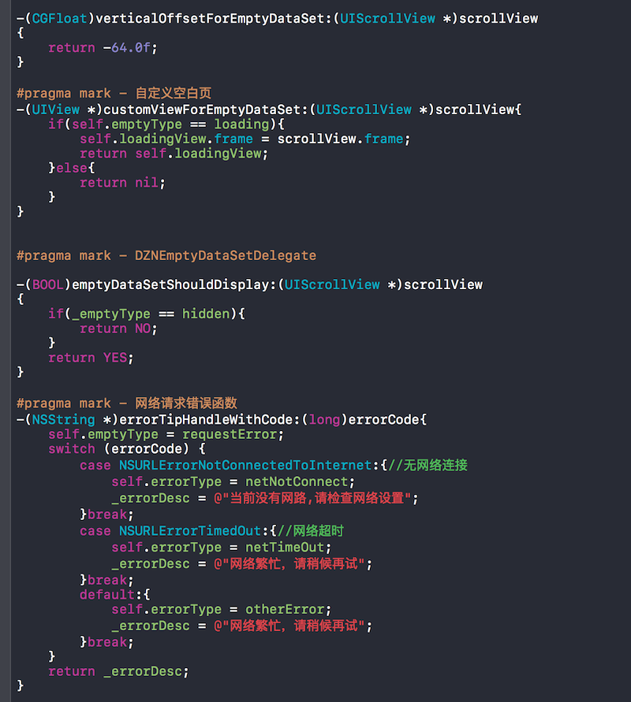
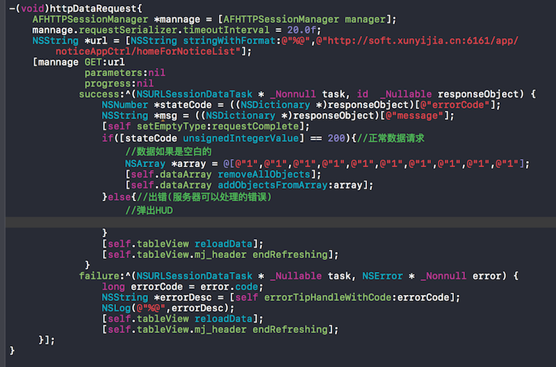

#app错误处理

一个标准的出错提示页如下：

简要介绍下日常中app可能出现的错误情况

###APP状态:
--
####三种状态:
>1. 加载
>2. 空数据
>3. 错误页

网络断开连接、网络请求超时、以及app请求错误。app请求错误又分为业务错误(HTTP错误码)(这种错误状态服务端一般都会返回错误描述字段如:`msg`)与URLDomian错误(如url不支持，无法连接服务器等错误)。
一些诸如404 400 等HTTP状态错误，就没必要展示给用户了。第一非专业人士看不懂这样的错误提示，也无法解决这样的问题。第二这样的提示反而给用户带来使用上的心里压力，给用户带来焦躁的情绪，从而留给用户不好的第一印象。
因此我把空白页提示按出现频率从上到下分为以下几种：

>1. 加载动画  ***
>2. 空白页   **
>3. 网络断开连接 **
>4. 网络请求超时 **
>5. app请求错误 *

一个经过测试组反复测试到客户手上的APP，加载出现的频率最高，空白/网络断开连接/网络请求超时其次，app请求错误出现的概率最低。但在app用户体验角度，这种情况虽然少但是一定要考虑到，可以展示给用户一些比较轻松的文字提示，或者一些幽默可爱的配图，减少出错状态下用户的焦躁情绪。而专业的请求问题，就留给开发人员去修复吧。

根据上图，我们明确一下 上拉下拉、空白页的各自职责。
###各自职责
--

>1.页面没数据时：空白页 全权负责加载/空数据/以及请求错误 状态展示
>2.页面有数据时: 
>>(1). 上拉加载更多：新请求的数据叠加在就数据后，页面始终有数据。所以不会出现空白页，加载状态由上拉负责，其他状态则有HUD 的方式展现给用户。
>>(2). 下拉更新界面: 新请求会清除原有数据，这时候请求不成功便会出现空白页。因此除了加载状态由上拉展示，其他状态都由空白页展示。
>

上代码:

~~~objectivec
#import <UIKit/UIKit.h>
#import "UIScrollView+EmptyDataSet.h"

typedef NS_ENUM(NSUInteger, BDEmptyType) {
    loading = 0,//加载动画
    requestComplete,//加载完成(空白页)
    requestError,//错误页
    hidden,//隐藏
};
typedef void(^BDdidTapEmptyView)();

@interface baseDznViewController : UIViewController<DZNEmptyDataSetSource,DZNEmptyDataSetDelegate>
@property(nonatomic,assign)BDEmptyType emptyType;//空白页类型
@property(nonatomic,copy)NSString *errorDesc;//错误描述,描述内容由errorTipHandleWithCode 函数处理

@property(nonatomic,copy)BDdidTapEmptyView didTapEmptyViewBlock;//空白页点击事件

-(void)setDidTapEmptyViewBlock:(BDdidTapEmptyView)didTapEmptyViewBlock;

-(NSString *)errorTipHandleWithCode:(long)errorCode;
@end
~~~
综上我们在头文件里定义了loading、requestComplete、requestError，不同的是这里多了一个hidden 状态，用于处理二级列表全部收拢情况，table中有sectionheader但是都是收拢状态，这时候numberOfRowsInSection 返回值为0导致空白页展示的情况。这里把loading放在首位，界面默认状态就是加载状态。
在.m文件中定义了子错误枚举量：

~~~objectivec
typedef NS_ENUM(NSUInteger, BDRequestErrorType) {
    netNotConnect,//无网络连接
    netTimeOut,//网络阻塞
    otherError,//其他错误
};
~~~
下面就贴一些关键性的代码，就不系讲了：

这里处理错误的时候，就处理成网络繁忙请稍候再试。
####使用demo
---

##附录：
--
###URLDOMAIN错误码:

~~~
enum
{
NSURLErrorUnknown = -1,//未知错误
NSURLErrorCancelled = -999,//请求取消
NSURLErrorBadURL = -1000,//错误的请求路径
NSURLErrorTimedOut = -1001,//请求超时
NSURLErrorUnsupportedURL = -1002,//不支持的URL
NSURLErrorCannotFindHost = -1003,//找不到服务器
NSURLErrorCannotConnectToHost = -1004,//不能连接到服务
NSURLErrorDataLengthExceedsMaximum = -1103,//数据过大
NSURLErrorNetworkConnectionLost = -1005,//网络连接断开
NSURLErrorDNSLookupFailed = -1006,//DNS错误
NSURLErrorHTTPTooManyRedirects = -1007,//
NSURLErrorResourceUnavailable = -1008,//
NSURLErrorNotConnectedToInternet = -1009,//无网络连接
NSURLErrorRedirectToNonExistentLocation = -1010,
NSURLErrorBadServerResponse = -1011,
NSURLErrorUserCancelledAuthentication = -1012,
NSURLErrorUserAuthenticationRequired = -1013,//需要用户认证
NSURLErrorZeroByteResource = -1014,
NSURLErrorCannotDecodeRawData = -1015,
NSURLErrorCannotDecodeContentData = -1016,
NSURLErrorCannotParseResponse = -1017,
NSURLErrorInternationalRoamingOff = -1018,
NSURLErrorCallIsActive = -1019,
NSURLErrorDataNotAllowed = -1020,
NSURLErrorRequestBodyStreamExhausted = -1021,
NSURLErrorFileDoesNotExist = -1100,
NSURLErrorFileIsDirectory = -1101,
NSURLErrorNoPermissionsToReadFile = -1102,
NSURLErrorSecureConnectionFailed = -1200,
NSURLErrorServerCertificateHasBadDate = -1201,
NSURLErrorServerCertificateUntrusted = -1202,
NSURLErrorServerCertificateHasUnknownRoot = -1203,
NSURLErrorServerCertificateNotYetValid = -1204,
NSURLErrorClientCertificateRejected = -1205,//证书错误
NSURLErrorClientCertificateRequired = -1206,//需要用户证书
NSURLErrorCannotLoadFromNetwork = -2000,
NSURLErrorCannotCreateFile = -3000,
NSURLErrorCannotOpenFile = -3001,
NSURLErrorCannotCloseFile = -3002,
NSURLErrorCannotWriteToFile = -3003,
NSURLErrorCannotRemoveFile = -3004,
NSURLErrorCannotMoveFile = -3005,
NSURLErrorDownloadDecodingFailedMidStream = -3006,
NSURLErrorDownloadDecodingFailedToComplete = -3007
}
~~~

##HTTP错误码:

~~~
所有 HTTP 状态代码及其定义。 
　代码  指示  
2xx  成功  
200  正常；请求已完成。  
201  正常；紧接 POST 命令。  
202  正常；已接受用于处理，但处理尚未完成。  
203  正常；部分信息 — 返回的信息只是一部分。  
204  正常；无响应 — 已接收请求，但不存在要回送的信息。  
3xx  重定向  
301  已移动 — 请求的数据具有新的位置且更改是永久的。  
302  已找到 — 请求的数据临时具有不同 URI。  
303  请参阅其它 — 可在另一 URI 下找到对请求的响应，且应使用 GET 方法检索此响应。  
304  未修改 — 未按预期修改文档。  
305  使用代理 — 必须通过位置字段中提供的代理来访问请求的资源。  
306  未使用 — 不再使用；保留此代码以便将来使用。  
4xx  客户机中出现的错误  
400  错误请求 — 请求中有语法问题，或不能满足请求。  
401  未授权 — 未授权客户机访问数据。  
402  需要付款 — 表示计费系统已有效。  
403  禁止 — 即使有授权也不需要访问。  
404  找不到 — 服务器找不到给定的资源；文档不存在。  
407  代理认证请求 — 客户机首先必须使用代理认证自身。  
415  介质类型不受支持 — 服务器拒绝服务请求，因为不支持请求实体的格式。  
5xx  服务器中出现的错误  
500  内部错误 — 因为意外情况，服务器不能完成请求。  
501  未执行 — 服务器不支持请求的工具。  
502  错误网关 — 服务器接收到来自上游服务器的无效响应。  
503  无法获得服务 — 由于临时过载或维护，服务器无法处理请求。

HTTP 400 - 请求无效 
HTTP 401.1 - 未授权：登录失败 
HTTP 401.2 - 未授权：服务器配置问题导致登录失败 
HTTP 401.3 - ACL 禁止访问资源 
HTTP 401.4 - 未授权：授权被筛选器拒绝 
HTTP 401.5 - 未授权：ISAPI 或 CGI 授权失败  
HTTP 403 - 禁止访问 
HTTP 403 - 对 Internet 服务管理器 (HTML) 的访问仅限于 Localhost 
HTTP 403.1 禁止访问：禁止可执行访问 
HTTP 403.2 - 禁止访问：禁止读访问 
HTTP 403.3 - 禁止访问：禁止写访问 
HTTP 403.4 - 禁止访问：要求 SSL 
HTTP 403.5 - 禁止访问：要求 SSL 128 
HTTP 403.6 - 禁止访问：IP 地址被拒绝 
HTTP 403.7 - 禁止访问：要求客户证书 
HTTP 403.8 - 禁止访问：禁止站点访问 
HTTP 403.9 - 禁止访问：连接的用户过多 
HTTP 403.10 - 禁止访问：配置无效 
HTTP 403.11 - 禁止访问：密码更改 
HTTP 403.12 - 禁止访问：映射器拒绝访问 
HTTP 403.13 - 禁止访问：客户证书已被吊销 
HTTP 403.15 - 禁止访问：客户访问许可过多 
HTTP 403.16 - 禁止访问：客户证书不可信或者无效 
HTTP 403.17 - 禁止访问：客户证书已经到期或者尚未生效 
HTTP 404.1 - 无法找到 Web 站点 
HTTP 404 - 无法找到文件 
HTTP 405 - 资源被禁止 
HTTP 406 - 无法接受 
HTTP 407 - 要求代理身份验证 
HTTP 410 - 永远不可用 
HTTP 412 - 先决条件失败 
HTTP 414 - 请求 - URI 太长 
HTTP 500 - 内部服务器错误 
HTTP 500.100 - 内部服务器错误 - ASP 错误 
HTTP 500-11 服务器关闭 
HTTP 500-12 应用程序重新启动 
HTTP 500-13 - 服务器太忙 
HTTP 500-14 - 应用程序无效 
HTTP 500-15 - 不允许请求 global.asa 
Error 501 - 未实现 
HTTP 502 - 网关错误 
~~~

###引用：
---
[Designing For The Empty States](https://tympanus.net/codrops/2013/01/09/designing-for-the-empty-states/)